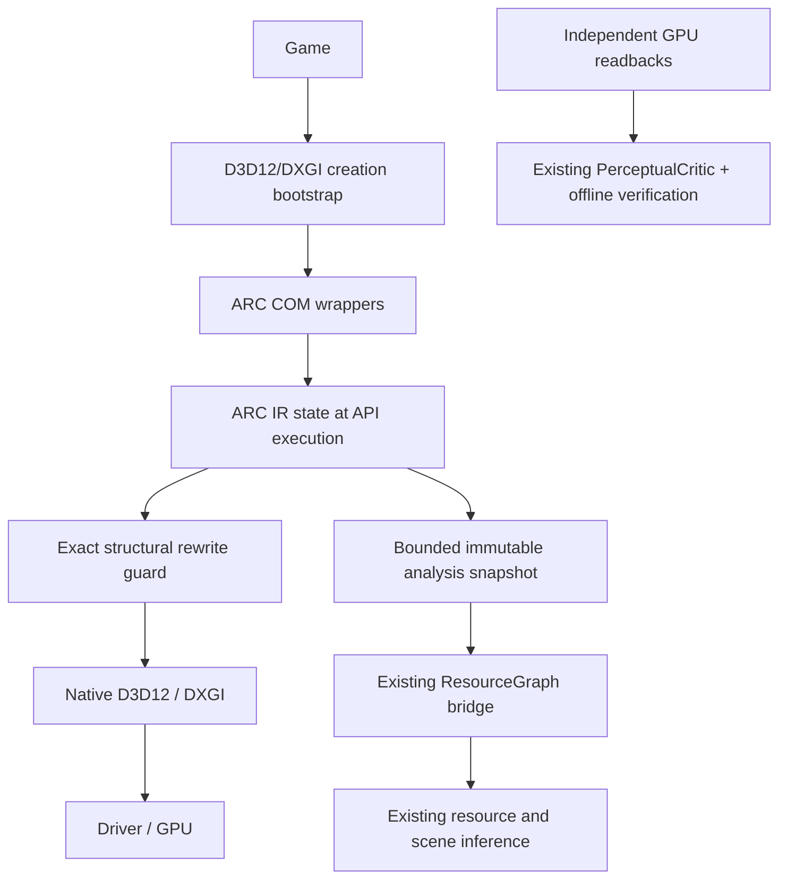

# ARC 2.0 semantic frontend

Status: experimental vertical slice under native and independent-codebase validation.
This is not a replacement Windows graphics driver and is not yet production coverage.

## Boundary and actual execution path

The general target remains `Game → ARC Frontend → ARC IR → Optimizer → D3D12`.
The implemented mutation path is deliberately narrow: exact consecutive repeated
RTV clear elimination. The general perceptual action controller is not silently
claimed to be migrated just because its data structures are linked. Temporal
visibility, importance, VRS, approximate shader transforms and dynamic image
admission still require explicit adapters and independent acceptance.

ARC Legacy / Observer Backend and the experimental CPU subsystem are retained.
No engine name, scene name or known shader hash is an optimizer condition.

## Frontend

The bootstrap redirects device/factory creation only. Applications continue to
use standard COM interfaces; dynamic-loading engines can assign the same generic
bootstrap function pointers. Native baseline leaves ARC2_MODE unset. Requested
ARC with a missing DLL fails explicitly, rather than silently measuring native.

D3D12 wrappers own native references and map native IUnknown identity to one live
wrapper. Child APIs unwrap ARC arguments before calling native methods. Descriptor
handles and GPU virtual addresses remain native values with separate IR ledgers.
Unsupported interface versions do not escape as untracked D3D12 objects. This can
make applications requiring those versions unsupported; it is not transparent
compatibility with every native interface. Interface gaps must be measured.

DXGI factory/swapchain wrappers cover factory creation, queue unwrapping,
GetBuffer, identity, Present/Present1, ResizeBuffers and teardown. Adapter/output
interfaces are native; the full DXGI parent/interface closure is not yet claimed.
Factory7 and SwapChain4 availability is currently required by these wrappers.
ResizeBuffers1 with a changed presentation queue has conservative unknown queue
attribution until exact per-buffer queue ownership is established.

## IR and semantics

[ARC2_IR.md](ARC2_IR.md) specifies IDs, generations, bindings, state snapshots,
submissions and synchronization. Resource IDs do not reuse addresses as identity.
Descriptor overwrites advance versions. Work snapshots precede forwarding and
are separate from mutable command-list state. Present attribution is established
only after a successful non-test native Present, with the pre-Present backbuffer.

The current source records versioned command payloads for Draw, DrawIndexed,
Dispatch, and ExecuteIndirect. Draw payloads retain counts, starts and signed base
vertex; indirect payloads distinguish an absent count buffer from a present but
unresolved object ID. IA state records vertex stride and raw DXGI index format;
RS state records the full bounded list of literal scissor rectangles. A null
scissor pointer with a nonzero count remains unknown. These are API-intent records,
not proof of GPU execution or a replayable command stream. The focused portable
IR test passed for these fields, and the owned native binding test verified exact
schema-1 dispatch payloads alongside GPU readback. Draw, indirect and IA/scissor
fields still need targeted native assertions. Earlier DLL timing matrices do not
validate this revised schema.

PSO creation retains SHA256 identities by stage. Available D3D reflection provides
declared register/space/range metadata. This does not prove which dynamically
indexed descriptor executes. Root-signature deserialization connects those ranges
to table bindings. Symbolic may-access intervals remain distinct from exact
resource identities. Reflection failure, unsupported DXIL paths, descriptor
ambiguity and missing modern API state stay unknown.

## Rewriting and validation

A repeated clear is eligible only with the same live RTV descriptor generation,
resource, bit-exact color and ordered rectangle list, and no intervening command
or state change. Reset, overwrite, resource destruction, unknown operations and
unsupported predication revoke eligibility. No cross-frame shadow cache or
approximate sampling is implemented by this rule. The removed command is an exact
redundant overwrite; it is not a quality preset or engine-specific optimization.

The native lab checks reference → modified → reference GPU readbacks, the existing
independent image critic, native debug errors, HRESULTs, COM identity and resize.
Readback/timestamps belong to the harness and are identical across compared modes;
pure frontend passthrough does not inject GPU commands. External-codebase evidence
must be evaluated separately: an owned fixture does not establish broad coverage.

## Cost and modes

`passthrough` captures IR without rewriting or semantic analysis worker.
`observe` adds a bounded-frequency background bridge to ResourceGraph and existing
resource/scene inferencers. `optimize` additionally permits the exact clear rule.
Unknown bindings are not a license to perform approximate rewrites.

Present telemetry uses a bounded memory buffer; disk output occurs at an explicit
session dump while the host is alive, never from a CRT/module destructor. Its wrapper-end timestamp approximates successful
Present-return cadence and never measures physical display FPS. GPU timing is
reported only where the harness actually queries it. The background bridge cost,
IR retention and lock contention are real overhead and are included in mode runs.
Targets are 0.20 ms/frame desirable and <=2% CPU cost diagnostic gate; failure is
reported rather than hidden by selecting a quiet sample.

Work/event retention and telemetry buffers are bounded. This is not a proof of
bounded total session memory: object tombstones and several resource/pipeline
metadata maps are retained after native destruction. A long resource-churn soak
and generation-safe metadata reclamation are still required before production
memory behavior can be claimed.

Source-only cost hypotheses, not measured attribution: each work call in
`Runtime::record_locked` copies the full pipeline snapshot while holding the
runtime's shared mutex, then `push_accesses` expands shader bindings against
root parameters and descriptor ranges. The per-list retention check follows
that expansion. Submission revisits recorded work to validate descriptor
generations. Frontend descriptor and GPU-address resolution also scan live
heaps or buffers under a registry mutex; descriptor copies repeat those scans
per slot. The optional CPU boundary meter must identify actual hot sites before
changing representation or lookup structures. Its cumulative thread wall cost
is not critical-path frame time.

## Coverage and remaining boundaries

The generated base-interface method inventory is under `src/arc2/generated`.
A forwarded method can still have unsupported semantic coverage; those are
separate dimensions. Modern interface versions, enhanced barriers, DXR state
objects, mesh operations, full shader interpretation and all DXGI interface
escapes require individual verification. See [matrix](ARC2_TEST_MATRIX.md) and
[results](ARC2_RESULTS.md) for actual tested outcomes, not projected support.

### Explicit interface and semantic coverage

| Surface | Implemented boundary | Remaining limitation |
|---|---|---|
| Device | Native-supported base through Device5 proxy; inherited IID identity | Native-supported Device6–14 QI is not wrapped; bgfx probes all nine, Cauldron probes Device8/10 |
| Command lists | Base, List5/List6 with inherited method slots; native revision selected even for base creation | Later list revisions and enhanced barriers are not exposed; unsupported effects forbid rewrite |
| Queue / allocator / fence | COM lifetime, forwarding, reset/submit and Signal/Wait records | Cross-process/external synchronization and every modern fence form are not proven |
| Resource / heap | Base interfaces, committed/placed/reserved creation forwarding and allocation metadata | Modern resource/heap/protected-session interfaces and full shared-handle closure are incomplete |
| Descriptors | Heap identity, per-slot versions, view kind/resource, copies and root table locations | Full view payloads and every slot generation across symbolic ranges are not closed |
| Root signatures / PSOs | Base and stream PSO forwarding, payload alignment, shader hashes, available reflection and root ranges | DXIL reflection failures remain unknown; full shader effects are not inferred |
| IA / RS / OM | Bindings, vertex stride, index format, bounded full scissor arrays, viewport and fixed pipeline fields | A recorded binding is not object visibility or proof of shader execution; unmodeled calls stay unknown |
| Copy / clear / resolve / queries | Native forwarding with typed work/access records where known | Texture subresource extents and all auxiliary effects are not fully normalized |
| Bundles / indirect | Forwarded; indirect API signature/count/buffer arguments are captured in the current source | Signature layouts, count-buffer contents and bundle effects are not expanded into executed draws or dispatches |
| DXGI | Factory7 / SwapChain4 wrappers, GetBuffer, Present, resize and parent lifetime | Adapter/output interface closure is partial; unsupported IID remains an explicit compatibility gap |
| DXR / mesh | Existing wrapped-list calls can forward with unknown-effect recording | State objects and full ray/mesh semantics are not an admitted rewrite surface |

Successful rendering does not erase a native-supported IID mismatch. These gaps
prevent claiming full application-visible HRESULT/interface transparency, even
when a particular workload's fallback path produces identical pixels.

Native references: [D3D12 swapchains](https://learn.microsoft.com/en-us/windows/win32/direct3d12/swap-chains)
and [core interfaces](https://learn.microsoft.com/en-us/windows/win32/direct3d12/direct3d-12-interfaces).
