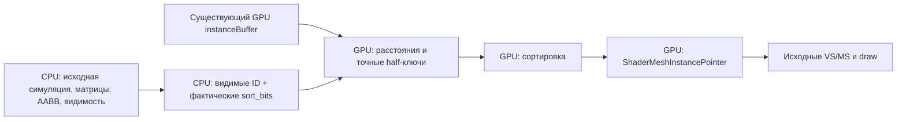

# GPU-resident подготовка отрисовки Wicked — 24 сентября 2026

**Положительный результат по CPU submission cadence на текущем стенде:** средний интервал уменьшился с **19,397 до 11,301 мс** (−41,74%; отношение частот подачи **1,716×**). Это не измеренный display FPS и не универсальный ARC.

**Питание:** активные прогоны потребляли по NVML в среднем 61,8–63,6 Вт, при частотах около 2 ГГц. Лимит 30 Вт не подтверждён; `power.limit` недоступен. Настройки мощности/частот агент не менял. Результат относится к фактическому режиму машины и не переносится на фиксированные 30 Вт.

## 1. Что расширилось относительно c7711e9

Граница переноса изменена. Старый маршрут отправлял матрицы и возвращал большие массивы границ/центров/видимости. В этом эксперименте матрицы, границы, видимость и ECS остаются исходной CPU-работой; переносится более дорогой законченный суффикс — подготовка очереди и instance-данных для двух основных проходов. Снятые ранее GPU-геометрические вычисления не приписываются новому варианту.

Новая цепочка использует уже загруженные GPU instance-данные. Отдельного readback для её результатов нет. Сцена не увеличивалась: 65 536 объектов, исходная анимация и камера, прежние настройки стенда. В измеренных окнах видимы 65 344 объекта; oracle подтвердил поверхность 1920×1080.

## 2. Какие CPU-потребители перенесены

| Исходное место | Что пропускается в C | Что сохраняется / добавляется |
|---|---|---|
| `DrawScene`: построение RenderQueue | Обход с расчётом расстояний и созданием RenderBatch в двух основных проходах | CPU-видимость остаётся; текущие ID и sort_bits копируются один раз |
| `RenderQueue::sort_opaque` | Две CPU-сортировки за кадр | GPU-сортировка учитывает фактические sort_bits; они не объявлены константой |
| `RenderMeshes`: per-instance цикл | Расчёт/упаковка указателей, dither/camera-mask обработка для доказанного простого класса, запись UPLOAD-потока | Оригинальный batch_flush, выбор PSO, mesh/index buffers и draw/DispatchMesh сохраняются |
| `RunObjectUpdateSystem` | Не переносится | В существующий обход добавлены проверки допуска; отдельного повторного обхода для этих проверок нет |

Счётчики стоят на ветвях, обходящих исходные циклы: **130 688 элементов построения, сортировки и упаковки за кадр** — по 65 344 для каждого из двух проходов. Это три вида работы над теми же объектами, не 392 064 разных объекта.

Количество экземпляров известно из CPU-входа, поэтому для этой цепочки сохранены исходные direct draw/DispatchMesh с тем же count. Indirect drawing рассмотрен, но не нужен для устранения readback; произвольный GPU-generated command stream не заявляется.

Непереносимые ECS/материальные эффекты, обновление матриц, построение AABB и CPU-видимость сохранены. Исследованный occlusion-проход отвергнут до нативной реализации: `Tests.cpp:77` выключает его, и включать отсутствующую baseline-работу было бы неверно.

## 3. Обмен, ожидания и собственная стоимость

| Компонент | C1 | C2 |
|---|---:|---:|
| CPU prepare, мс | 0.4531 | 0.4685 |
| CPU запись GPU-команд, мс | 0.1172 | 0.1245 |
| GPU-цепочка, мс | 0.5198 | 0.5080 |

На вход новой цепочки — **522 752 байта (~0,499 МиБ) за кадр**. Это ID + sort_bits; исходные два UPLOAD-потока instance-указателей суммарно имели тот же размер. Прочие штатные uploads приложения, включая instanceBuffer, остаются.

**Readback данных цепочки в скоростном режиме: 0. Собственных CPU fence waits: 0.** Дополнительные два timestamp-запроса для измерения GPU используют существующий profiler readback; их стоимость входит в результат. Проверочные буферы/изображения включены только в oracle.

Основные DEFAULT-буферы ключей и указателей — **2,5 МиБ** на два штатных frame slots. Это размер этих буферов, не полный расход RAM/VRAM/драйвера. Вход занимает диапазон существующего frame upload allocator. Переиспользование следует существующему завершению frame slot; очередь кадров и её глубина не увеличены.

Команды записываются после штатных uploads в `cmd_prepareframe`; существующий порядок/зависимости команд защищают draw-потребителей. CPU не ждёт результатов новой цепочки. Время GPU не складывается повторно с CPU wall time. Стоимость per-object admission guard отдельно не изолирована и включена в полную каденцию.

## 4. Производительность

A — сохранённый исходный EXE; B — новая сборка с выключенным переносом; C — включённая цепочка. Порядок **A1–B1–C1, C2–B2–A2**. Каждый запуск 15 секунд, окно 6–15 секунд; все паузы внутри окна сохранены. Оригинальный EXE и новые сборки запускались по одному штатному пути.

| Запуск | Среднее, мс | p95, мс | p99, мс | Интервалов |
|---|---:|---:|---:|---:|
| A1 | 19.317 | 22.496 | 25.345 | 465 |
| B1 | 19.519 | 22.707 | 25.151 | 460 |
| C1 | 11.263 | 13.681 | 17.148 | 798 |
| C2 | 11.339 | 13.075 | 16.755 | 792 |
| B2 | 19.960 | 23.374 | 25.595 | 450 |
| A2 | 19.476 | 22.309 | 26.178 | 461 |

Нейтральная сборка B: в среднем 19.739 мс против 19.397 мс у A. Консервативная экономия по общей доступной метрике — **7.978 мс**, прежний инженерный порог — 0.970 мс. Этот расчёт применяется к CPU submission cadence, не выдаётся за полный O2/display gate.

GPU-профайлер новой сборки дополнительно показывает GPU-цепочку ~0,51 мс и общий GPU frame span ~4,92–5,08 мс в C. У B span ~5,46–5,55 мс. Это длительности уже завершённых GPU-диапазонов, не интервалы готовности/показа кадров; исходный сохранённый A таких CSV-полей не экспортирует. Прямое сравнение completed/display FPS не выполнено.

Снижение GPU span нельзя целиком приписать более удачному доступу к памяти: в C заметно выросли частота и мощность GPU.

| Запуск | Средняя мощность GPU, Вт | Средняя частота, МГц | Температура, °C |
|---|---:|---:|---|
| A1 | 33.49 | 1549 | 38–39 |
| B1 | 28.44 | 1401 | 41–41 |
| C1 | 63.59 | 2002 | 47–50 |
| C2 | 61.78 | 2017 | 50–53 |
| B2 | 32.22 | 1466 | 49–50 |
| A2 | 35.23 | 1587 | 50–51 |

Телеметрия NVML собиралась одинаково во всех режимах. Окно аппаратных samples приблизительно привязано к времени запуска, не к каждому кадру. Power policy не менялась агентом; фиксированные частоты/30W не проверены. Поэтому итог относится к наблюдавшемуся boost-режиму.

## Корректность конечного потребителя

Финальный oracle проверил **27 313 792 записи в 418 кадрах**: float32-расстояния сравниваются побитно, half-ключи и индексы — точно; DWORD-поток instance-указателей сверяется с исходными данными. При одинаковых ключах сравнивается точное множество индексов группы. Отдельная исходная CPU-отрисовка того же кадра проверяет отсутствие наблюдаемого эффекта от перестановки равных ключей: **primitive-ID и depth совпали на всех пикселях**. Непустых проверенных пикселей — 740 635 211.

Проверка использует реально потребляемый GPU-буфер и отдельные reference RT/depth. Основной depth не поддерживает SRV, поэтому oracle читает его через отдельную shader-readable копию. Производственный путь это копирование не выполняет.

Исправлены найденные проблемы: неверный SRV-доступ диагностического depth; несовпадение legacy f32tof16 с pinned CPU-конверсией; разница sqrt в один float32 ULP. Последние две исправлены явной integer-конверсией и точной midpoint-коррекцией, **без ослабления допусков**. GPU int64 capability проверяется при подключении. Независимый host-тест проверил коррекцию на 10 005 входах с семью соседними начальными приближениями.

Начальный native AV, сообщения D3D12 и отвергнутые oracle-запуски сохранены. Инкрементальная LTCG MSVC дала C1001; полная optimized LTCG-линковка прошла. CPU Release-оптимизация не выключалась.

Допуск экспериментальный: один global scene, общий opaque mesh/LOD/stencil, без fade/alpha/foreground/специальных visibility-исключений, rigid mesh, фиксированная текущая камера, ограниченный нормальный численный диапазон. Это необходимые guards, не универсальное доказательство эквивалентности для произвольной геометрии. Новый сюжет/рендерер требует нового consumer oracle.

## 5. Что ограничивает дальше

`Application Render` снизился примерно с 10,37–10,54 до 2,85–2,99 мс. Крупнейшая оставшаяся измеренная CPU-область — `Application Update` **6,68–6,73 мс**, внутри неё `RenderPath3D Update` **5,73–5,78 мс**. Родитель и вложенная область не суммируются. Разделение running/ready/wait отдельных задач ещё не выполнено.

Следующий конкретный эксперимент — атрибуция Scene Update на производство матриц, объектные ECS-эффекты и ожидания; выбирать перенос только вместе с его реальными потребителями. Ни PID, ни универсальный scheduler, ни автоматический binary extractor в этот проход не добавлены.

Оценка оставшегося бюджета от текущей реализации: около 7,98 мс консервативной экономии по каденции, или около 7,01 мс сверх инженерного порога. Это не разрешение считать будущий автоматический перехват бесплатным: новый маршрут передачи/ожиданий нужно измерять заново.

## Артефакты и воспроизведение

- [График](../evidence/resident-consumer-20260924/frametimes.svg).
- [Все raw CSV, параметры, shader binaries и диагностические логи](../evidence/resident-consumer-20260924/raw-measurements.zip).
- [Сводные расчёты](../evidence/resident-consumer-20260924/comparison.json) и [SHA-256/manifest](../evidence/resident-consumer-20260924/manifest.json).
- Код, патч и команды: `experiments/wicked-resident-consumer/README.md`.

После сравнения восстановлен исходный EXE. Эксперимент по умолчанию выключен. Коммерческие игры не запускались; результат на них и на универсальный ARC не переносится.
